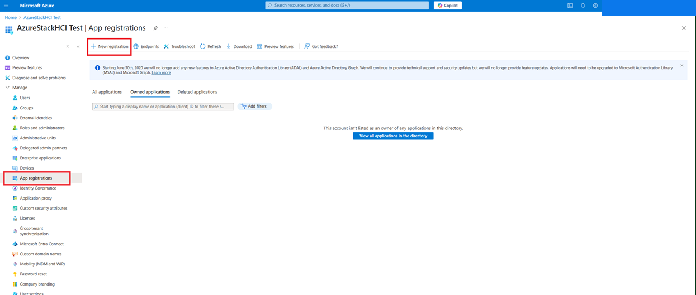
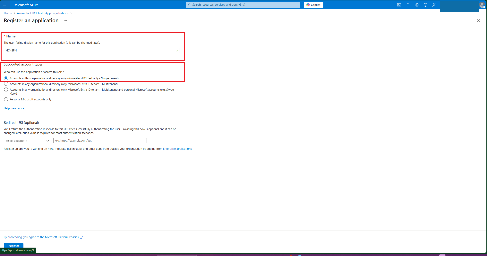
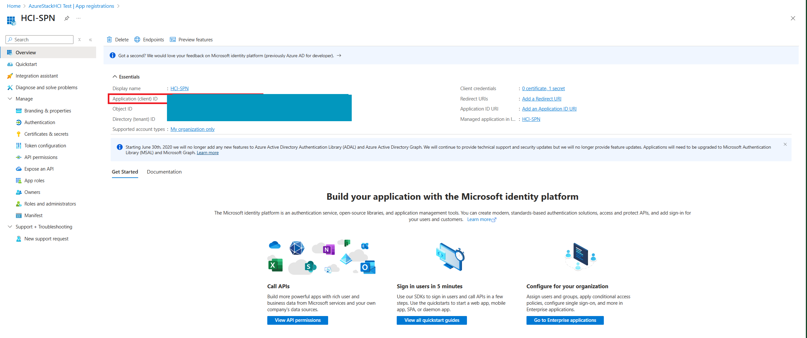
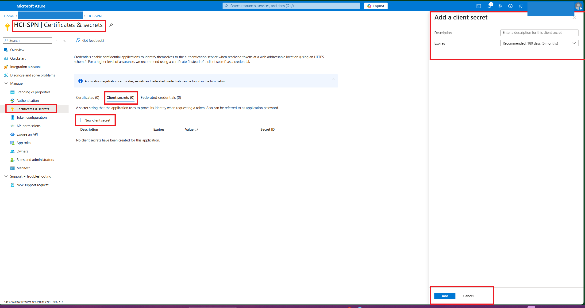
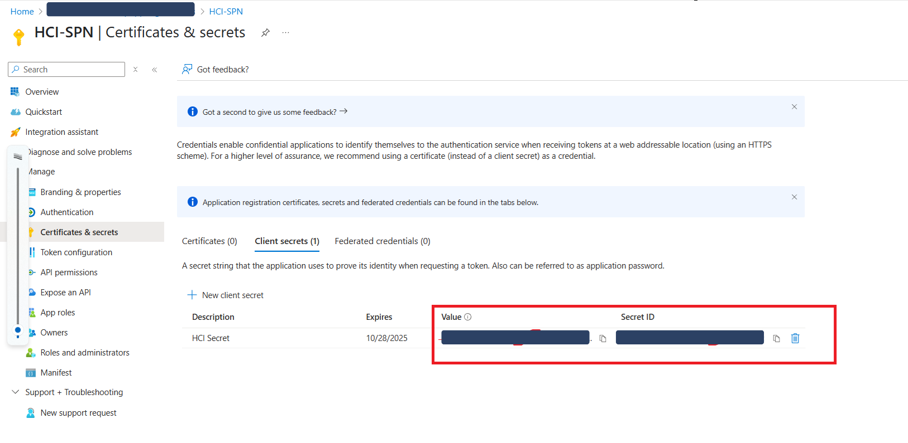
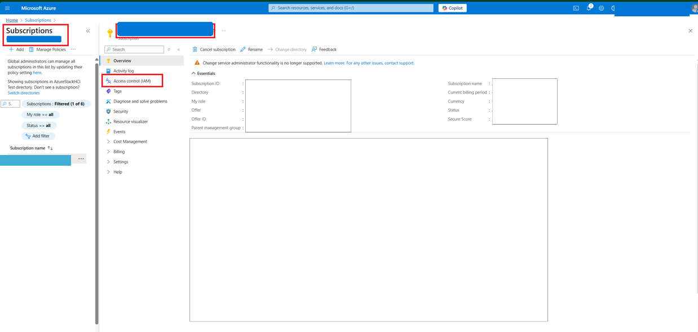
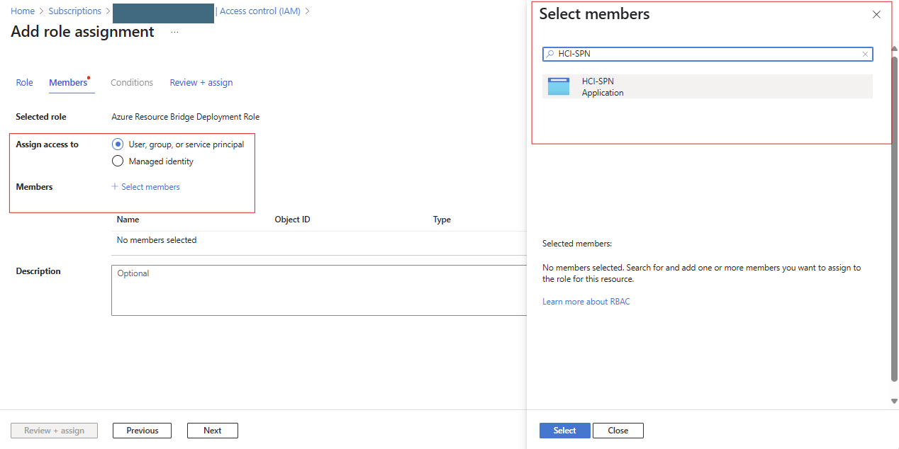

# TSG | 23H2 | 10.2411.3.2 | Missing SP during deployment


# Symptoms

The portal or response from the ARM request contains the error when trying to run a deployment or a validate command.

  

```

Type 'DeployArb' of Role 'MocArb' raised an exception: [DeployArb:Fetching SP in CloudDeployment Scenario] Exception calling 'GetCredential' with '1' argument(s): 'Exception of type 'CloudEngine.Configurations.SecretNotFoundException' was thrown.' at at Get-CloudDeploymentServicePrincipal,

```

# Mitigation Details    

## Generating the SPN in Azure


  
1.  Sign in to Azure Portal

### Navigate to "App Registrations"

  


### Register a New Application

    1.  Name: Choose a name like `HCI-SPN` or `HCI-Deployment-App`. 
    2.  Supported account types: Select "Accounts in this organizational directory only".
    3.  Leave Redirect URI blank for now.
    4.  Click "Register".

  


  

### Create a Client Secret

1.  After registration, go to the HCI-SPN overview to copy the Application id.
2.  Then, go to Certificates & secrets in the left pane. 
3.  Under Client secrets, click "New client secret". 
4.  Add a description (e.g., "HCI secret") and expiry (e.g., 1 year or 2 years).
5.  Click "Add". 
6.  Copy the secret value now – you won’t see it again.







  

### Assign Permissions

*   Navigate to Subscriptions in the Azure portal. 
*   Select your subscription.
*   Click Access Control (IAM). 
*   Click Add > Add role assignment.


  
  
*   Role: Select "Azure Resource Bridge Deployment Role"
*   Assign access to: `User, group, or service principal`. 
*   Search for your app name (e.g., `HCI-SPN`) and select it. 
*   Click Save.




  
  

## Setting the SPN on the host

The instructions below are to set the SPN in the ECEStore. The below commands must be run on the **seed node** running deployment. The seed node can be identified by examining which host has the C:\ECEStore folder. This is usually the first host in the node list of the arm template or portal node list but not always.

``` Powershell
Import-Module C:\CloudDeployment\ECEngine\EnterpriseCloudEngine.psd1
Import-Module ECEClient


$appId = "<application (client) Id>"  
$secret = "<hci secret value (not secret Id)>"

$password = ConvertTo-SecureString  $secret -AsPlainText -Force
$cred = New-Object System.Management.Automation.PSCredential($appId, $password)


Set-ECESecret -ContainerName "DefaultARBApplication" -Credential $cred | Out-Null
Set-ECEServiceSecret -ContainerName "DefaultARBApplication" -Credential $cred | Out-Null

```

After running the above code resume the deployment through the portal or resubmit the arm template