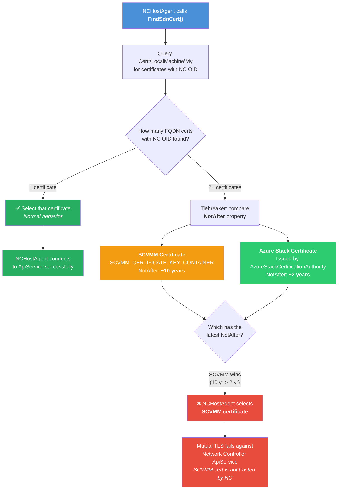

# Conflicting SCVMM Certificate Breaks SDN Connectivity on Azure Local

<table border="1" cellpadding="6" cellspacing="0" style="border-collapse:collapse; margin-bottom:1em;">
  <tr>
    <th style="text-align:left; width: 180px;">Component</th>
    <td><strong>Software Defined Networking (SDN) / Network Controller</strong></td>
  </tr>
  <tr>
    <th style="text-align:left; width: 180px;">Severity</th>
    <td><strong>Critical</strong></td>
  </tr>
  <tr>
    <th style="text-align:left;">Applicable Scenarios</th>
    <td><strong>Deployment / Post-Deployment / Live Migration</strong></td>
  </tr>
  <tr>
    <th style="text-align:left;">Affected Versions</th>
    <td><strong>Azure Local with Arc-Enabled SDN (all versions)</strong></td>
  </tr>
</table>

## Overview

When System Center Virtual Machine Manager (SCVMM) has been previously installed or is co-located in an Azure Local environment using Arc-Enabled SDN, the SCVMM self-signed certificate can interfere with SDN mutual TLS authentication. The SCVMM certificate is tagged with the NetworkController OID, causing SDN components (such as NCHostAgent) to select the wrong certificate when establishing trust. This breaks Network Controller connectivity, SDN policy programming, and VM network operations.

> **Important:** SCVMM is not supported with Arc-Enabled SDN on Azure Local. If SCVMM was previously used, residual certificates must be cleaned up before or after SDN deployment.

## Symptoms

**What users will observe:**

- Virtual machines lose network connectivity when live-migrated to a new host
- SDN policy programming failures across one or more hosts

**Common error messages:**

SDN fabric health check failures when running `Debug-SdnFabricInfrastructure`:

```
Test-SdnHostAgentConnectionStateToApiService : FAILED
Test-SdnCertificateMultiple : FAILED
```


**Observable behaviors:**

- One or more hosts unable to program SDN policies
- Live migration to/from affected hosts results in VM network loss
- `Debug-SdnFabricInfrastructure` reports certificate and connectivity failures
- Network Controller API calls fail intermittently or consistently from affected hosts

## Root Cause

The SCVMM self-signed certificate (`SCVMM_CERTIFICATE_KEY_CONTAINER<hostname>`) is present in the certificate store and is tagged with the NetworkController OID. 
When NCHostAgent performs certificate selection for mutual TLS authentication, it incorrectly select the SCVMM certificate instead of the legitimate Network Controller certificate. 
This breaks the TLS trust chain between NCHostAgent and the Network Controller ApiService as it will not trust this SCVMM certificate.




## Resolution

### Prerequisites

- Administrative access (local admin or domain admin) to the affected Azure Local host(s)

### Steps

1. **Identify the conflicting SCVMM certificate**

   On each affected host, open the local machine certificate store and look for the SCVMM self-signed certificate. It will have a subject or friendly name containing `SCVMM_CERTIFICATE_KEY_CONTAINER`.

   ```powershell
   Get-SdnServerCertificate -NetworkControllerOid | Format-List Thumbprint, Subject, NotBefore, NotAfter, Issuer, FriendlyName
   ```

1. **Remove the conflicting SCVMM certificate**

   Remove the SCVMM certificate from the personal certificate store on each affected host.

   ```powershell
   $certThumbprintToRemove = '<THUMBPRINT_OF_SCVMM_CERT>'
   $certStorePath = 'cert:\LocalMachine\My'
   
   $certToRemove = Get-ChildItem -Path $certStorePath | Where-Object { $_.Thumbprint -ieq $certThumbprintToRemove }
   if (-not $certToRemove) {
       Write-Warning "No certificate with thumbprint '$certThumbprintToRemove' was found in store '$certStorePath'. No changes were made."
   } else {
       $certToRemove | Remove-Item -WhatIf # remove the -WhatIf statement once you confirmed the proper certificate is being removed
   }
   ```

1. Restart NCHostAgent

   ```powershell
   Restart-Service -Name NcHostAgent -Force
   ```

1. **Run SDN fabric health diagnostics to verify resolution**

   ```powershell
   # Re-run SDN fabric diagnostics to confirm certificate issues are resolved
   Debug-SdnFabricInfrastructure

   # Verify NCHostAgent connectivity and certificate health pass
   # Expected: Test-SdnHostAgentConnectionStateToApiService and Test-SdnCertificateMultiple should now pass
   ```

1. **Validate VM networking is restored**
   - Verify live migration connectivity
   - Live-migrate a test VM to and from the previously affected host and confirm network connectivity is maintained
