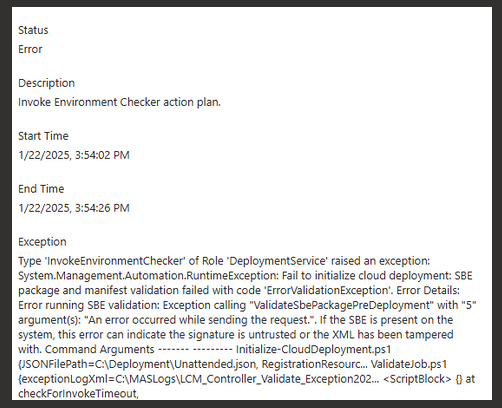

# Solution Builder Extension (SBE) validation blocked by firewall

# Overview

Attempting to deploy Azure Local fails with:
- **Description**: Invoke Environment Checker action plan.
- **Exception**:
   - 2411 and older: `Exception calling "ValidateSbePackagePreDeployment" with "5" argument(s): "An error occurred while sending the request."`.
   - 2502 and newer: `Error downloading SBE manifest from 'https://aka.ms/AzureStackSBEUpdate/...' with error '<more details here>`. this is a newer version of the same exception message that goes on to provide details about which endpoint was blocked by the firewall

See below for an example image of how this is reported by the portal for Azure Local version 10.2411.x:

# Issue Validation

An exception similar to above is reported that specifically includes the message `Exception calling "ValidateSbePackagePreDeployment" with "5" argument(s): "An error occurred while sending the request."`.

This indicates the request to reach the online Solution Builder Extension (SBE) update manifest for the hardware vendor failed.  

# Cause

The deployment process for Azure Local uses the solution extension that is located on each system at `C:\SBE` to perform hardware update and configuration tasks during the deployment process. To assure an invalid or recalled extension has not been placed in that location the predeployment logic needs to be able to access the online manifest from your hardware vendor to confirm the extension files at `C:\SBE` are supported.

The most common cause of this issue is the firewall blocking access to one of the following addresses or the redirection target of one of those addresses.

Note: Each Azure Local instance uses the BIOS reported manufacturer to determine which solution extension updates are available using a vendor-specific redirection URI (pick the address that matches your server Manufacturer or SBE family):

- https://aka.ms/AzureStackSBEUpdate/DataON
- https://aka.ms/AzureStackSBEUpdate/Dell
- https://aka.ms/AzureStackSBEUpdate/HitachiVantara
- https://aka.ms/AzureStackSBEUpdate/HPE
- https://aka.ms/AzureStackSBEUpdate/HPE-ProLiant-Standard
- https://aka.ms/AzureStackSBEUpdate/Lenovo
- https://aka.ms/AzureStackSBEUpdate/Manufacturer-as-reported-by-BIOS

# Mitigation Details

Adjust your firewall rules to allow outbound https (port 443) access to the following 3 endpoints:

1. The redirection target of the appropriate aka.ms link in the list above
2. **aka.ms**  - This redirects Azure Local instances to hardware vendor specific SBE manifest endpoints
3. **redirectiontool.trafficmanager.net**  - This is part of the Microsoft service that implements the aka.ms redirection

**TIP:** To determine the redirection target you can just click on the appropriate aka.ms link above in your browser and note the URL that it redirects to in your browser address bar.

If in doubt, please review the documentation provided by your hardware vendor as part of the Solution Builder Extension (SBE) for guidance on firewall rules required to support their extension.
