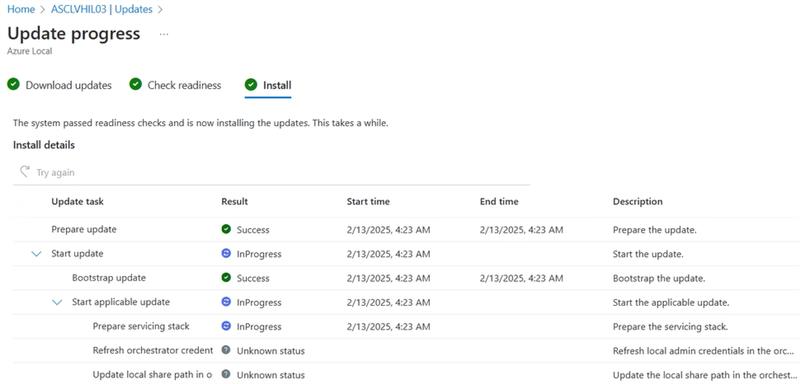

# ECEAgent Causing Slowness during Update

## Symptoms

The slowness can cause the update to take significantly longer than expected and possibly timeout. The exact symptom of this issue is that the step with name 'Failover ECE Service to new Node' takes a long time to complete. If this step takes longer than 15 minutes to complete the cluster  is likely experiencing this issue. The portal will look like the screenshot below and get stuck for a long time.


### Detection Script
This detection script can be used to detect if ECE is experiencing the issue while an update is running. If the update is not currently running but the previous update got stuck and the portal looked like the screen shot above apply the remediation and then retry the update. If the update gets stuck again while it is in progress run the detection script again and follows its recommendations.

``` Powershell
Import-Module ECEClient
$ErrorActionPreference = "Stop"

$eceClient = Create-ECEClusterServiceClient
try
{
    $plans = $eceClient.GetActionPlanInstances().GetAwaiter().GetResult()
}
catch
{
    $ErrorMsg = "There was an error retrieving action plan information from the ECE service. Please try again in a few minutes"
    throw $ErrorMsg
}

$masUpdate = $plans | Where-Object { ($null -ne $_.ActionPlanName ) -and (($_.ActionPlanName -match "MAS Update")) }
$sortedMASUpdate = @( $masUpdate | Sort-Object LastModifiedDateTime )
$mostRecentMASUpdate = $sortedMASUpdate[-1]
if ($mostRecentMASUpdate -ne $null )
{
    $xml = $mostRecentMASUpdate.ProgressAsXml
    $task = Select-Xml -XPath "//Step[@Name='Failover ECE Service to new Node']" -Content $xml | Select-Object -ExpandProperty Node | Select-Object -exp Task
    $startTime = Get-Date $task.StartTimeUtc
    $endTime = $task.EndTimeUtc

    if ($mostRecentMASUpdate.Status -eq "Running" -or $mostRecentMASUpdate.Status -eq "Waiting" )
    {
        if  ($startTime.AddMinutes(15) -lt $(Get-Date) -and [string]::IsNullOrEmpty($endTime))
        {
            Write-Host "ECE slowness issue detected. Please run the agent restart remediation from the ECEAgent Causing Slowness during Update TSG"
        }
    }
}

Write-Host "An update is not running or the slowness issue was not detected"


```

### Issue Confirmation
1) Examine the progress xml for the update. 
2) The interface FailoverECEService has the status Inprogress or Pending
3) The time since the update was resumed **or** the start time of the interface is more than 15 minutes ago

## Mitigation Details  

Running the below command from one of the cluster nodes while the agent is stuck should clear up the slowness and the update should auto remediate its state. The script forces a restart of the ECEAgent on all of the nodes in the cluster

``` Powershell 
 $scriptBlock = {
            try {
                Write-Host "Running ECEAgent service restart on $(hostname)"
                $eceagent = Get-WmiObject -Class Win32_Service -Filter "Name='ECEAgent'"
                Stop-Process $eceagent.ProcessId -Force
                Start-Sleep -Seconds 5
                $eceagent = Get-WmiObject -Class Win32_Service -Filter "Name='ECEAgent'"
                
                $retry = 0
                $filepath = $eceagent.PathName.Replace("C:", $("\\" + $(hostname) + "\c$")).Replace('"',"")
                while ($eceagent.State -ne "Running")
                {
                    Start-Process -FilePath $filepath
                    $eceagent = Get-WmiObject -Class Win32_Service -Filter "Name='ECEAgent'"
                    if(++$retry -ge 5)
                    {
                        throw "Failed to start ECEAgent during agent restart on $(hostname)"
                    }
                    Start-Sleep -Seconds 1
                }
                Write-Host "ECE Agent service was restarted on $(hostname)"
            }
            catch {
                throw "ECE Agent service does not exist. Unable to restart on $(hostname)"
            }
        }
    $nodes = Get-Clusternode | select -expandproperty Name

    
    
    Invoke-Command -ComputerName $nodes -ScriptBlock $scriptBlock -Verbose -ErrorAction 'Stop'
```